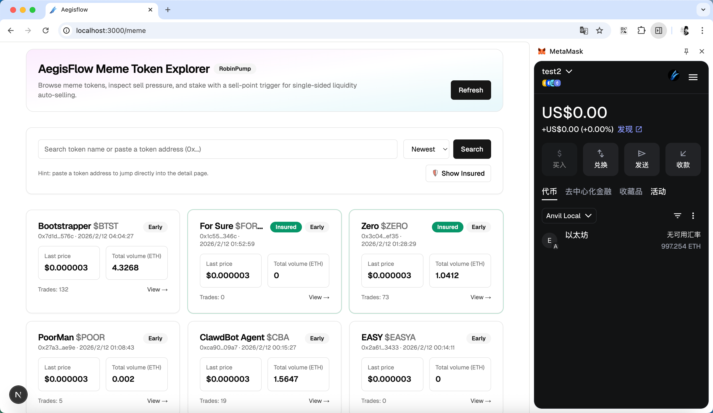
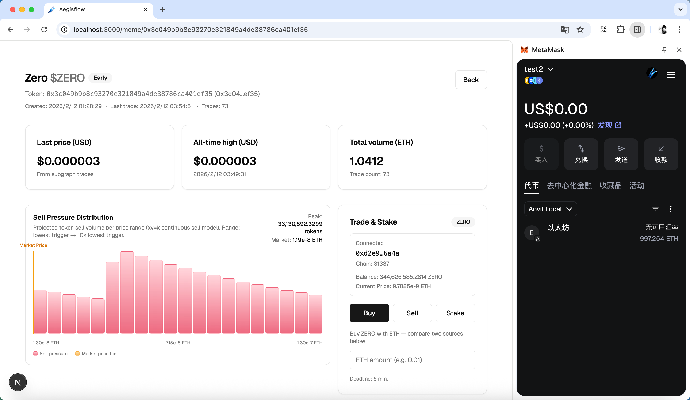
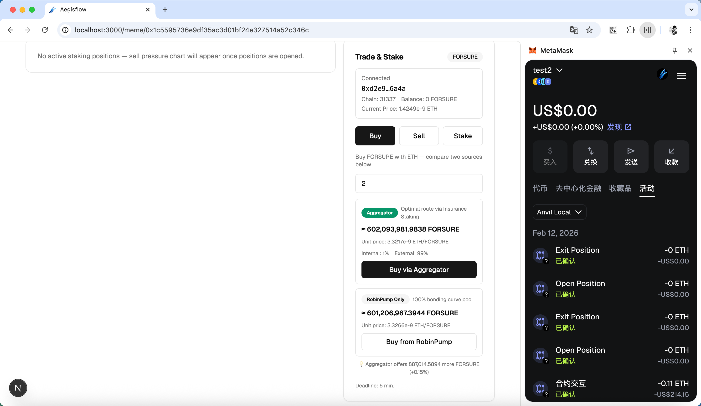
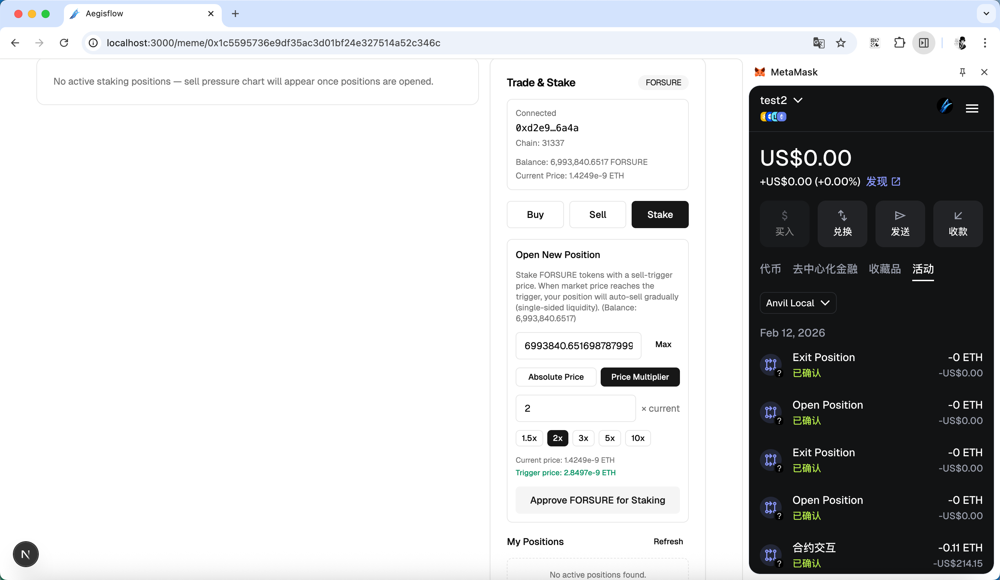
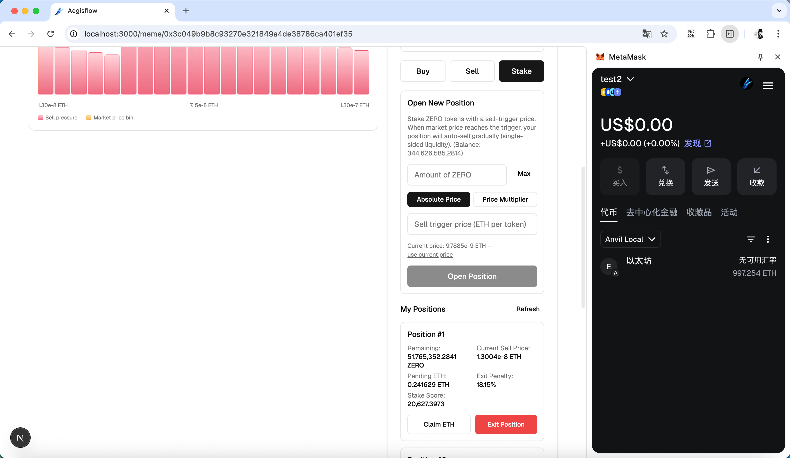
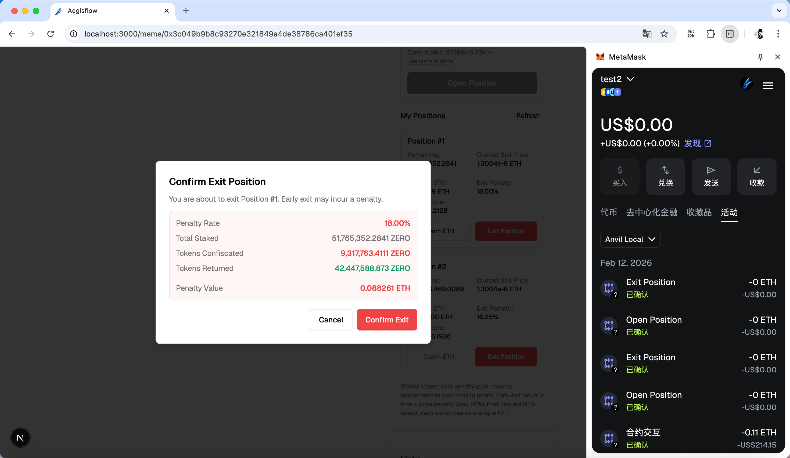

# AegisFlow: Slow Exit Liquidity Protocol for Meme Tokens

> Anti-rug staking protocol that penalizes early exits and rewards long-term holders with insurance-grade meme token protection.

---

## Table of Contents

- [AegisFlow: Slow Exit Liquidity Protocol for Meme Tokens](#aegisflow-slow-exit-liquidity-protocol-for-meme-tokens)
  - [Table of Contents](#table-of-contents)
  - [Demo Video](#demo-video)
  - [Screenshots](#screenshots)
  - [Summary](#summary)
  - [The Problem](#the-problem)
  - [Our Solution](#our-solution)
    - [1. Penalty-Based Exit Disincentive](#1-penalty-based-exit-disincentive)
    - [2. Single-Sided Liquidity with Auto-Sell](#2-single-sided-liquidity-with-auto-sell)
    - [3. Buy Aggregator](#3-buy-aggregator)
    - [4. Transparent Sell Pressure Chart](#4-transparent-sell-pressure-chart)
  - [How It Works](#how-it-works)
    - [Staking \& Position NFTs](#staking--position-nfts)
    - [Single-Sided Liquidity (xy=k Auto-Sell)](#single-sided-liquidity-xyk-auto-sell)
    - [Exit Penalty System](#exit-penalty-system)
    - [Buy Aggregator](#buy-aggregator)
    - [Sell Pressure Visualization](#sell-pressure-visualization)
  - [Blockchain Interaction](#blockchain-interaction)
    - [Smart Contract Architecture](#smart-contract-architecture)
    - [On-Chain Transaction Flow](#on-chain-transaction-flow)
    - [Frontend ↔ Chain Interaction](#frontend--chain-interaction)
  - [Technical Stack](#technical-stack)
    - [Smart Contracts](#smart-contracts)
    - [Frontend](#frontend)
    - [Sponsor Tech](#sponsor-tech)
  - [Project Structure](#project-structure)
  - [Getting Started](#getting-started)
    - [Prerequisites](#prerequisites)
    - [Smart Contracts](#smart-contracts-1)
    - [Frontend](#frontend-1)
  - [Presentation](#presentation)
  - [Team](#team)
  - [License](#license)

---

## Demo Video


https://github.com/user-attachments/assets/8625e136-b3bf-474f-b36e-76a0ad4e7b5f


---

## Screenshots








---

## Summary

AegisFlow is a decentralized insurance protocol for meme token markets. It introduces an NFT-based staking mechanism that disincentivizes rug pulls through exit penalties, provides single-sided liquidity via an automated xy=k selling curve, and aggregates liquidity across internal staking pools and external AMMs for optimal trade execution.

---

## The Problem

Meme token markets suffer from a fundamental trust deficit:

1. **Rug Pulls**: Large holders can dump their tokens instantly, crashing the price and devastating retail participants. There is no mechanism to slow down or penalize sudden mass exits.
2. **No Downside Protection**: Unlike traditional markets with circuit breakers or insurance, meme token holders have zero protection against coordinated sell-offs.
3. **Fragmented Liquidity**: Buyers must rely solely on a single bonding curve pool, with no way to access deeper liquidity or get better prices.
4. **Information Asymmetry**: Retail users have no visibility into the sell pressure from large holders — they cannot see when or at what price staked tokens will be sold.

---

## Our Solution

AegisFlow solves these problems with a multi-layered approach:

### 1. Penalty-Based Exit Disincentive
When stakers exit early, they are penalized based on **time** (how long they've held) and **price** (how far the token has moved). Confiscated tokens are automatically sold for ETH and distributed to remaining stakers, creating an insurance pool that compensates loyal holders.

### 2. Single-Sided Liquidity with Auto-Sell
Each staking position defines a **sell trigger price**. As the market price rises above the trigger, the position automatically and continuously sells tokens following an `x²·p = k` curve (single-sided xy=k model). This provides gradual, predictable sell pressure instead of sudden dumps.

### 3. Buy Aggregator
A ternary-search-based aggregator finds the optimal split between internal staking liquidity and the external RobinPump pool, giving buyers the best possible execution price.

### 4. Transparent Sell Pressure Chart
A real-time logarithmic bar chart shows the projected sell volume at each price level, computed from all active positions using the xy=k model. This gives every market participant full visibility into upcoming sell pressure.

---

## How It Works

### Staking & Position NFTs

Each staking position is minted as an **ERC-721 NFT**, enabling:

- Multiple positions per wallet (different sell trigger prices and amounts)
- Transferability of positions (NFTs can be traded on secondary markets)
- On-chain proof of staking behavior

**Opening a Position:**
```
User deposits tokens → Specifies sell trigger price → Receives Position NFT
```

The position enters the sorted liquidity list, ready for auto-selling when the market price reaches the trigger.

### Single-Sided Liquidity (xy=k Auto-Sell)

Positions follow a **virtual constant-product model**:

```
x² · p = k  (where x = remaining tokens, p = price)
```

As market price increases from `p₀` to `p₁`, the tokens sold from a position with trigger price `x` and remaining tokens `s` is:

```
sold = √(s² · x / p₀) − √(s² · x / p₁)
```

This provides smooth, continuous selling — no sudden dumps. A permissionless `poke()` function allows anyone (including MEV bots, incentivized by configurable rewards) to trigger the auto-sell synchronization.

### Exit Penalty System

Early exits incur a two-component penalty (capped at 20%):

| Component | Formula | Range |
|-----------|---------|-------|
| **Time Penalty** | `0.7 / (days_held + 7)` | 10% → 5% over 7 days |
| **Price Penalty** | `0.1 / (current_price / trigger_price)` | 10% at trigger → 5% at 2× |

Confiscated tokens are sold for ETH and distributed to all stakers proportional to their **stake score**:

```
stake_score = virtual_remaining_tokens × time_weight_coefficient
```

The time weight ramps linearly from 0 to 1 over 7 days, preventing new stakers from immediately leeching penalty rewards.

### Buy Aggregator

The `getBestBuyRatio()` function uses ternary search to find the optimal percentage split between:

1. **Internal Pool** — buying from staking positions (single-sided liquidity)
2. **External Pool** — buying from the RobinPump bonding curve

This is executed via `staticCall` simulation, showing users both estimated outputs and the optimal routing before committing.

### Sell Pressure Visualization

The sell pressure chart computes projected token sell volume across price ranges using the xy=k model. It features:

- **Logarithmic x-axis** spanning from the lowest trigger price to 10× (one full decade)
- **Per-bin token volume** computed by summing each position's contribution via the `√(s²·x/p₀) − √(s²·x/p₁)` formula
- **Current market price marker** for context
- **Hover tooltips** with token volume and estimated ETH volume

---

## Blockchain Interaction

### Smart Contract Architecture

```
┌─────────────────────────────┐
│   MemeInsuranceRouter       │  Factory / Registry
│   (One per deployment)      │
│                             │
│  createStaking(token)       │──→ Deploys per-token staking
│  stakingByToken(token)      │──→ Lookup staking address
│  allTokensLength() / tokenAt()  │──→ Enumerate insured tokens
└─────────────────────────────┘
            │
            ▼
┌─────────────────────────────┐
│   MemeInsuranceStaking      │  Per-Token Insurance Pool
│   (ERC-721 + ReentrancyGuard + Pausable)
│                             │
│  openPosition(amount, price)│──→ Stake tokens, mint NFT
│  exitPosition(tokenId)      │──→ Exit with penalty
│  claim(tokenId)             │──→ Claim ETH rewards
│  poke(maxPositions)         │──→ Trigger auto-sells
│  buyTokenMix(...)           │──→ Aggregated buy
│  getBestBuyRatio(...)       │──→ Optimal routing (staticCall)
└─────────────────────────────┘
            │
            ▼
┌─────────────────────────────┐
│   External Pool (RobinPump) │  Bonding Curve AMM
│                             │
│  buy() / sell()             │──→ Direct trades
│  getCurrentPrice()          │──→ Price oracle
└─────────────────────────────┘
```

### On-Chain Transaction Flow

| Action | Contract | Function | Description |
|--------|----------|----------|-------------|
| Deploy Pool | Router | `createStaking(token)` | Creates insurance pool for a meme token |
| Stake Tokens | Staking | `openPosition(amount, sellPrice)` | Opens NFT-based staking position |
| Buy (Aggregated) | Staking | `buyTokenMix(minOut, deadline, maxPos, ratio)` | Buys via optimal internal/external split |
| Buy (Pool Only) | Pool | `buy(minOut, deadline)` | Direct buy from RobinPump |
| Sell | Pool | `sell(amountIn, minOut, deadline)` | Sells tokens for ETH |
| Trigger Auto-Sell | Staking | `poke(maxPositions)` | Syncs positions to current price |
| Exit Position | Staking | `exitPosition(tokenId)` | Exits with penalty calculation |
| Claim Rewards | Staking | `claim(tokenId)` | Claims accumulated ETH |

### Frontend ↔ Chain Interaction

- **Provider**: `ethers.js v6` with `BrowserProvider` (wallet) and `JsonRpcProvider` (server-side reads)
- **Read Operations**: `staticCall` for buy/sell simulations and penalty previews
- **Write Operations**: Direct contract calls via wallet signer
- **Token Discovery**: Goldsky-hosted subgraph (RobinPump pump-charts) for meme token metadata
- **Insured Token Detection**: Server-side Router contract enumeration via `allTokensLength()` / `tokenAt()`

---

## Technical Stack

### Smart Contracts

| Technology | Usage |
|------------|-------|
| **Solidity ^0.8.20** | Smart contract language |
| **Foundry** | Development framework (compile, test, deploy) |
| **OpenZeppelin Contracts** | ERC-721, Ownable, ReentrancyGuard, Pausable, SafeERC20, Math |

### Frontend

| Technology | Usage |
|------------|-------|
| **Next.js 16** (App Router) | React framework with Server Components |
| **React 19** | UI library |
| **TypeScript 5.7** | Type-safe development |
| **ethers.js v6** | Blockchain interaction (providers, signers, ABIs, staticCall) |
| **Tailwind CSS** | Utility-first styling |
| **shadcn/ui + Radix UI** | Accessible component library |
| **Goldsky Subgraph** | GraphQL API for RobinPump token data |

### Sponsor Tech

| Sponsor | Technology | How We Used It |
|---------|-----------|----------------|
| **RobinPump** | Bonding Curve Pools | External liquidity source for buy/sell, price oracle via `getCurrentPrice()` |
| **Goldsky** | Subgraph Indexing | Token discovery, trade history, and metadata via `pump-charts` subgraph |
| **Ethereum / EVM** | Smart Contracts | On-chain staking, penalty calculation, auto-sell execution, NFT positions |

---

## Project Structure

```
.
├── contracts/                    # Foundry project
│   ├── src/
│   │   ├── MemeInsuranceRouter.sol    # Factory/registry for per-token staking
│   │   └── MemeInsuranceStaking.sol   # Core insurance staking contract (ERC-721)
│   ├── test/
│   │   └── MemeInsuranceStaking.t.sol # Contract tests
│   ├── script/
│   │   └── DeployRouter.s.sol         # Deployment script
│   ├── lib/                           # Dependencies (OpenZeppelin, forge-std)
│   ├── foundry.toml                   # Foundry configuration
│   └── testdeploy.sh                  # Local deployment helper
│
├── new_frontend/                 # Next.js 16 application
│   ├── app/
│   │   ├── page.tsx                   # Root redirect → /meme
│   │   ├── layout.tsx                 # Root layout (wallet, theme, nav)
│   │   ├── meme/
│   │   │   ├── page.tsx               # Token explorer (search, filter, sort)
│   │   │   └── [token]/
│   │   │       └── page.tsx           # Token detail (stats, chart, actions)
│   ├── components/
│   │   ├── meme/
│   │   │   ├── token-actions.tsx      # Buy / Sell / Stake / Deploy Pool UI
│   │   │   ├── sell-pressure-chart.tsx # Logarithmic sell pressure histogram
│   │   │   └── token-card.tsx         # Token list card with insured badge
│   │   ├── wallet/
│   │   │   ├── wallet-provider.tsx    # Wallet context
│   │   │   └── wallet-connect-button.tsx
│   │   └── ui/                        # shadcn/ui components
│   ├── lib/
│   │   ├── contracts.ts               # ABIs, addresses, provider helpers
│   │   ├── insured-tokens.ts          # Server-side insured token queries
│   │   ├── robinpump.ts              # Goldsky subgraph client
│   │   └── format.ts                 # Formatting utilities
│   ├── .env.local                     # Environment variables
│   └── package.json
│
├── idea.md                       # Original project concept
└── README.md                     # This file
```

---

## Getting Started

### Prerequisites

- [Node.js](https://nodejs.org/) v18+
- [Foundry](https://getfoundry.sh/) (forge, cast, anvil)
- A browser wallet (e.g. MetaMask)

### Smart Contracts

```bash
# 1. Navigate to contracts
cd contracts

# 2. Install dependencies
forge install

# 3. Build
forge build

# 4. Run tests
forge test

# 5. Start local Anvil node
anvil --fork-url wss://chaotic-silent-telescope.base-mainnet.quiknode.pro/217355da5faa0381b55fe0ab8cac1fef3f1bde57/ --fork-block-number -1 --fork-chain-id 31337

# 6. Deploy Router (in a separate terminal)
./testdeploy.sh
```

### Frontend

```bash
# 1. Navigate to frontend
cd new_frontend

# 2. Install dependencies
npm install

# 3. Configure environment
#    Edit .env.local:
#    NEXT_PUBLIC_ROUTER_ADDRESS=<deployed_router_address>
#    NEXT_PUBLIC_RPC_URL=http://127.0.0.1:8545

# 4. Start development server
npm run dev

# 5. Open http://localhost:3000 in your browser
```

**Environment Variables:**

| Variable | Description | Default |
|----------|-------------|---------|
| `NEXT_PUBLIC_ROUTER_ADDRESS` | Deployed Router contract address | — |
| `NEXT_PUBLIC_RPC_URL` | JSON-RPC endpoint for server-side reads | `http://127.0.0.1:8545` |

---

## Presentation

> [Canva Presentation Slides](https://www.canva.com/design/DAHAjbqXB5c/UEBCfj8bX3O_L2_MA7omXg/edit?utm_content=DAHAjbqXB5c&utm_campaign=designshare&utm_medium=link2&utm_source=sharebutton)

---

## Team

**PKUInfosec** — Peking University Information Security Laboratory

---

## License

This project was built for the Consensus 2026 Hackathon.
